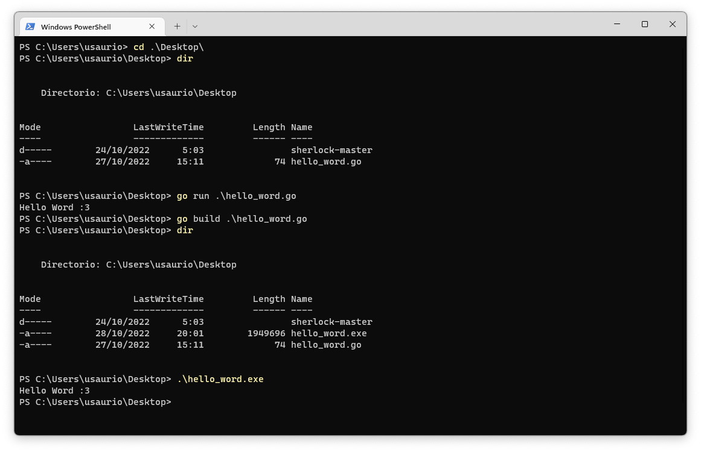

# 0. Instalación De GO y Herramientas.

## 0.1. Instalacion de GO.

- Abrir nuestro navegador favorito.
- Buscar "Golang".

- Acceder a la pagina de "https://go.dev/"

    

- Acceder a descargas.

    

- Descargar la version para nuestro Sistema Operativo.

> Proceder con la instalacion completa.
Recuerden reiniciar las terminales para que go se aplique en el PATCH correctamente.
    
- Windows.
https://user-images.githubusercontent.com/56109439/198364722-56bb57d0-4bee-407a-acd9-a11b7a0c3743.mov

- macOS.
https://user-images.githubusercontent.com/56109439/198364738-1a0bc6ec-1536-4177-a598-5bd7796d31d6.mov

# 0.2. Elegir IDE y Terminal.

## 0.2.1. IDE's

Entre todos los [IDE's](https://github.com/golang/go/wiki/IDEsAndTextEditorPlugins) que puedes encontrar para programar Go, le recomendamos principalmente 2;

## [VS Code](https://code.visualstudio.com/download)
### Plugins
- [Go para Visual Studio Code (Go Team Google)](https://marketplace.visualstudio.com/items?itemName=golang.go)

## [Sublime Text](https://www.sublimetext.com/download)

### Plugins
- [LSP-gopls (GitHub)](https://github.com/sublimelsp/LSP-gopls)
    - [LSP-gopls (packagecontrol)](https://packagecontrol.io/packages/LSP-gopls)

- [GoSublime (GitHub)](https://github.com/DisposaBoy/GoSublime)
    - [GoSublime (packagecontrol)](https://packagecontrol.io/packages/GoSublime)

- [Golang Build (GitHub)](https://github.com/golang/sublime-build)
    - [Golang Build (packagecontrol)](https://packagecontrol.io/packages/Golang%20Build)

## 0.2.2. Terminal.

### 0.2.2.1. Terminales disponibles en Windows.
- Simbolo del sistema o CMD.

- PowerShell

### 0.2.2.2. Terminales disponibles en macOS.
- Terminal

    
    
- iTerm

    
