# 1. Introducción a Go y la Terminal.

En este apartado, obtendrá una breve introducción a la programación de Go. Obteniendo los siguientes conocimientos;

* Uso basico de la Terminal.
* Escribir un código simple en go; "Hola, mundo".
* USo de go en Terminal.
    * Utilizar el comando para ejecutar el código.go
    * Use la herramienta de detección de paquetes Go para encontrar paquetes que pueda usar por su cuenta código.
* Funciones de llamada de un módulo externo.

## 1.1. Uso basico de la Terminal.

- pwd (Bash y PowerShell)
    > Muestra la direccion absoluta del directorio donde nos encontramos.
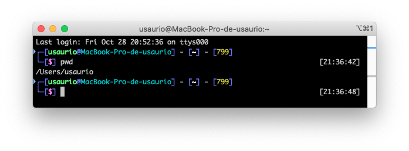
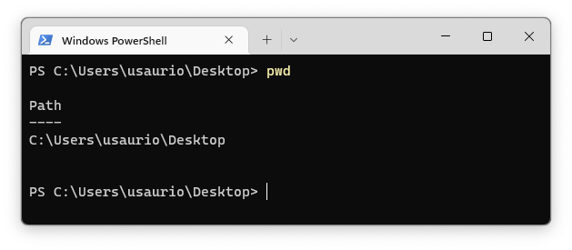

- ls (Bash y PowerShell)
    > Lista todos los directorios que se encuentra en el direccorio actual.
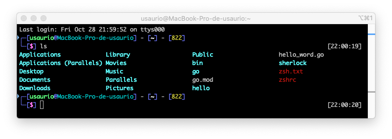
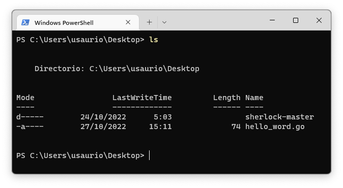

- dir (PowerShell y CMD)
    > Lista todos los directorios que se encuentra en el directorio actual.
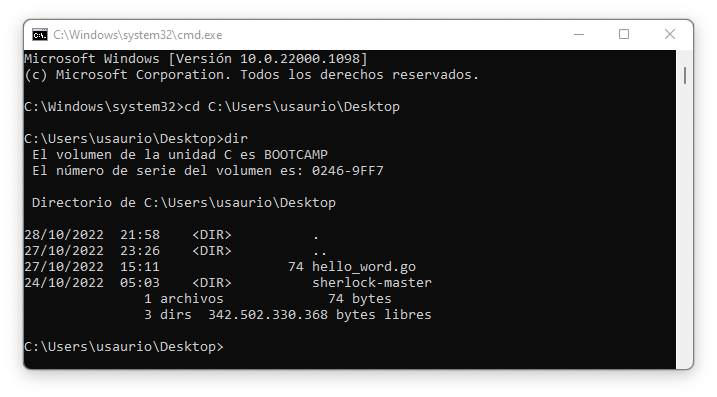
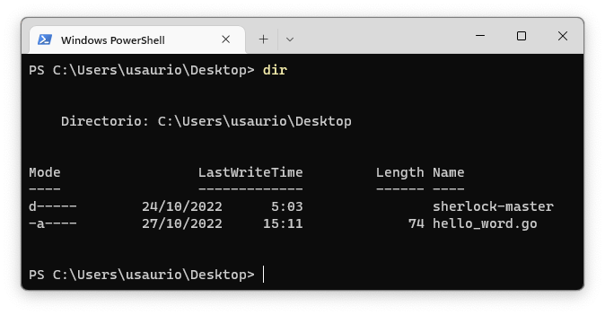

- mkdir (Bash, CMD y PowerShell)
    > Crea directorios.
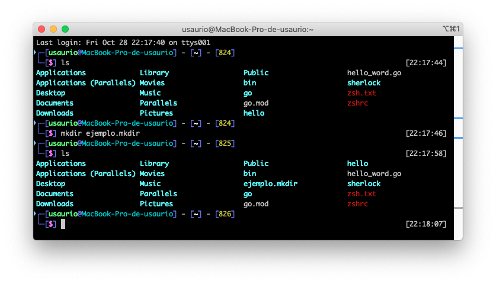

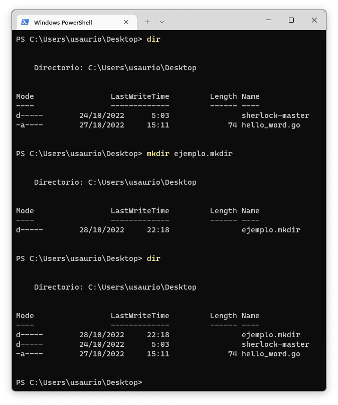

## 1.2. Escribir codigo.

> Antes de nada vamos a crear un repositorio, al que llamaremos "hello".
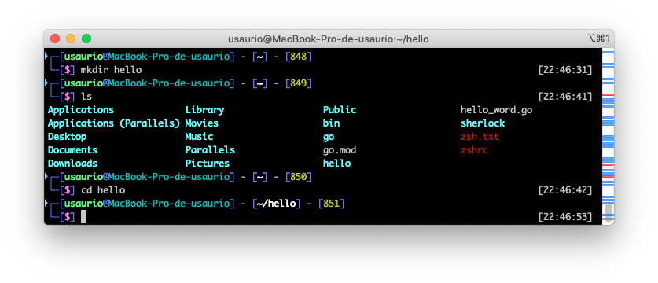

> Una vez dentro de nuestro directorio, crearemos un documento al que llamaremos "hello.go". Y en el cual pegaremos el siguiente codigo.
~~~
package main

import "fmt"

func main() {
    fmt.Println("Hello, World!")
}
~~~
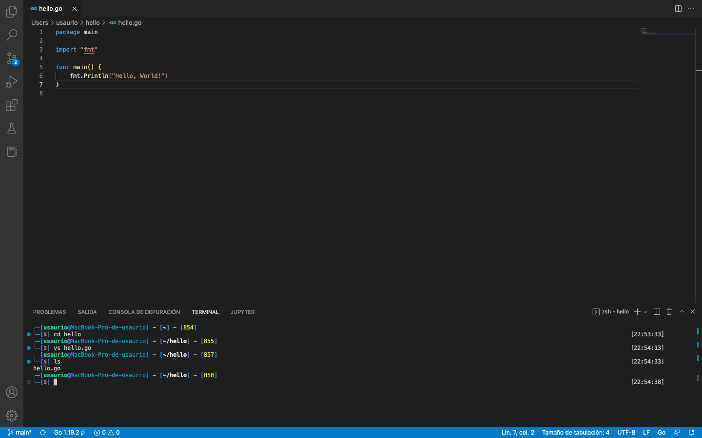
* ¿Que hay en nuestro codigo?
    - Declaracion de un paquete "main" (un paquete es una forma de agrupar funciones y se compone de todos los archivos que se encuentran en el mismo directorio).
    - Importacion del paquete "ftm", el cual contiene funciones para dar formato al texto (incluida la impresion en consola).
    - Implementacion de una funcion para imprimir un mensaje en consola.

## 1.3. Uso basico de Go en la Terminal.

- go run ejemplo.go
> Permite ejecutar el codigo Go sin ser compilado.
>>Para probar el comando, ejecutaremos nuestro "hello.go";
>>
>>`go run hello.go`
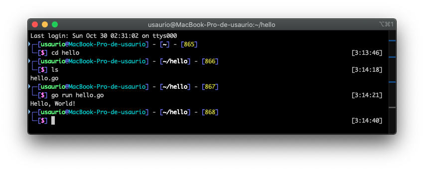

- go help
> Proporciona una lista de los comandos de GO.
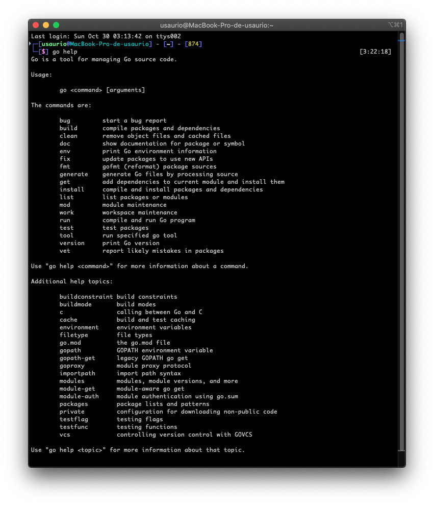

- go build ejemplo.go
> Permite compilar nuestro codigo. 
>>Para probar el comando, compilaremos nuestro "hello.go".
>>
>>`go build hello.go`
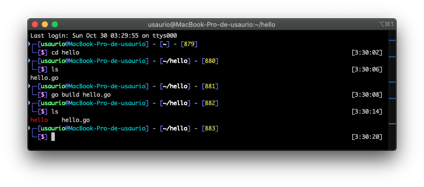

