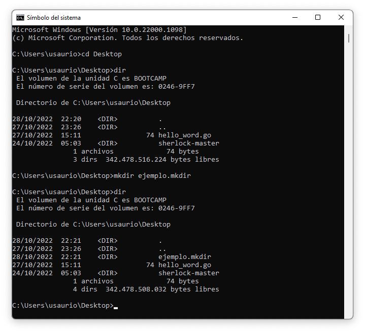

# 1. Introducción a Go y la Terminal.

En este apartado, obtendrá una breve introducción a la programación de Go. Obteniendo los siguientes conocimientos;

* Uso basico de la Terminal.
* Escribir un código simple de "Hola, mundo".
* Utilizar el comando para ejecutar el código.go
* Use la herramienta de detección de paquetes Go para encontrar paquetes que pueda usar por su cuenta código.
* Funciones de llamada de un módulo externo.

## 1.1. Uso basico de la Terminal.

- pwd (Bash y PowerShell)
    > Muestra la direccion absoluta del directorio donde nos encontramos.

- ls (Bash y PowerShell)
    > Lista todos los directorios que se encuentra en el direccorio actual.

- dir (PowerShell y CMD)
    > Lista todos los directorios que se encuentra en el directorio actual.

- mkdir (Bash, CMD y PowerShell)
    > Crea directorios.

## 1.2. Escribir codigo.

> Le recomendamos crear un direcctorio, para organizar sus codigos y la documentacion que le podamos proporcionar.

