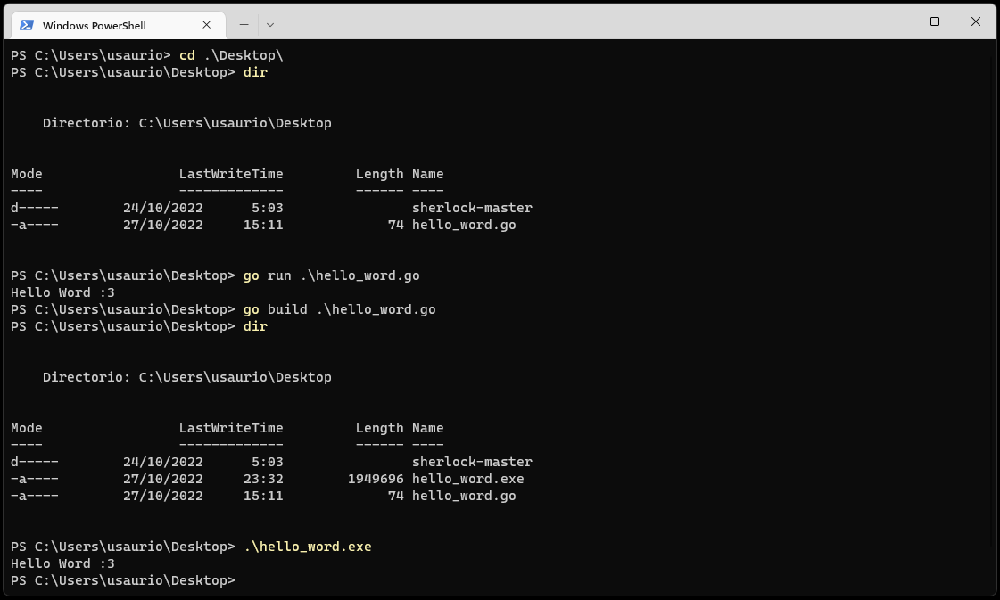
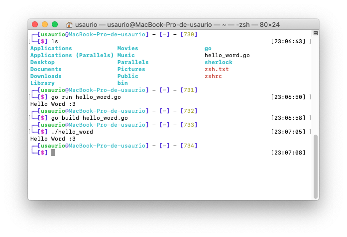
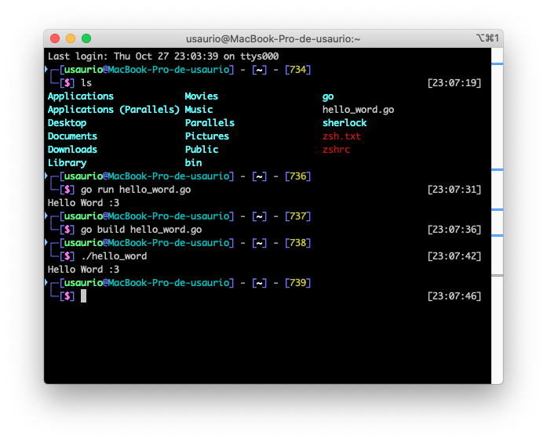

# 2. Elegir IDE y Terminal.

## 2.1. IDE's

Entre todos los [IDE's](https://github.com/golang/go/wiki/IDEsAndTextEditorPlugins) que puedes encontrar para programar Go, le recomendamos principalmente 2;

## [VS Code](https://code.visualstudio.com/download)
### Plugins
- [Go para Visual Studio Code (Go Team Google)](https://marketplace.visualstudio.com/items?itemName=golang.go)

## [Sublime Text](https://www.sublimetext.com/download)

### Plugins
- [LSP-gopls (GitHub)](https://github.com/sublimelsp/LSP-gopls)
    - [LSP-gopls (packagecontrol)](https://packagecontrol.io/packages/LSP-gopls)

- [GoSublime (GitHub)](https://github.com/DisposaBoy/GoSublime)
    - [GoSublime (packagecontrol)](https://packagecontrol.io/packages/GoSublime)

- [Golang Build (GitHub)](https://github.com/golang/sublime-build)
    - [Golang Build (packagecontrol)](https://packagecontrol.io/packages/Golang%20Build)

## 2.2. Terminal.

### 2.2.1. Terminales disponibles en Windows.
- Simbolo del sistema.

- PowerShell

### 2.2.2. Terminales disponibles en macOS.
- Terminal.

- iTerm.

